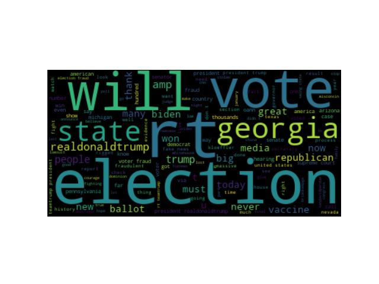
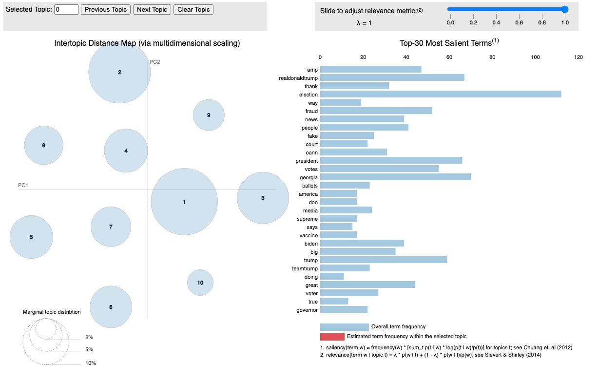

# Wordcloud and LDA Example

This repository contains code that creates wordclouds and LDA analysis based on twitter messages.

Miles Porter  
January 7, 2021  

Requirements:

Python 3.7 with the following pip packages installed:

pip install tweepy==3.10.0    
pip install pandas==1.2.0  
pip install sklearn==0.0  
pip install wordcloud==1.8.1  
pip install matplotlib==3.3.3  
pip install pyLDAvis==2.1.2  

Twitter connectivity:

This can can be run with our without connectivity to twitter.  If you wish to download tweets, you will need to
configure the keys.json file with the correct information based on your twitter developer account.  More information can 
be found at http://www.tweepy.org.  

Running the application.  

## Example 1.  Downloading and displaying tweets.

Run the code with the default options will result in the application attempting to use previously downloaded tweets from 
@realDonnaldTrump for both a wordcloud and a LDA analysis of 10 topics.  The tweets should be stored in the file 
new_realDonaldTrump_tweets.csv.  A sample of this file along with a file for Bill Gates is provided as part of this
repository.  In order to view the wordcloud and LDA analysis, run the program as follows:

python main.py  

The code will first display a wordcloud using matplotlib and the python wordcloud package.  An example can be seen 
below.

Once this image has been closed, the code will launch a local webserver on port 8888 to display the results of an LDA analysis.

An example of that interface can be seen here:

Note that the above image is an interactive web page for exploring the results of the Latent Dirichlet Allocation 
analysis of the loaded data.

## Example 2.

To download new data, twitter api_key, api_secred, access_token and access_secret must be included in the keys.json file
in the model root directory.  Please see tweepy.org for information on how to set these values up.  Twitter does provide
free developer accounts, however note that the accounts are rate limited.  The code accounts for these rate limits, 
however, it may take some time to download more than a few thousand tweets.  The following command can be used to 
download 1000 tweets for WilliamShatner:

python main.py --user=WilliamShatner --tweets=1000 --wordcloud=Y  

Results will be similar to those seen above for donald trump.

## Help

Note that you can run the main.py file with the --help flag for the different options available.

<pre>
python main.py --help
usage: main.py [-h] [--load LOAD] [--tweets TWEETS] [--user USER]
               [--wordcloud WORDCLOUD]

optional arguments:
  -h, --help            show this help message and exit
  --load LOAD           Load data from twitter (Y/N). Requires keys.json file.
                        (default='N')
  --tweets TWEETS       Number of tweets to analyze. (default=1000)
  --user USER           Twitter handle. (default='realDonaldTrump')
  --wordcloud WORDCLOUD
                        Draw wordcloud. (default='Y')
</pre>
